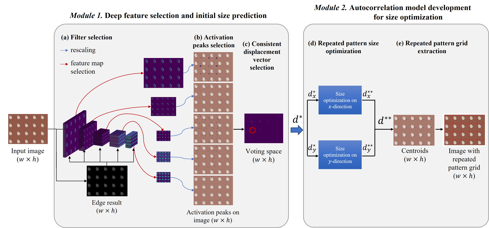

This repository contains code and materials for the paper _Efficient and Effective Detection of Repeated Pattern from Fronto-Parallel Images with Unknown Visual Contents,_ contributed by Hong Qu, Yanghong Zhou, K. P. Chau, and P. Y. Mok*. All rights reserved by authors.

-----
## Introduction

This study is on the efficient detection of repeated patterns from unknown fronto-parallel images. Repeated patterns are everywhere. A repeated pattern is the smallest unit that can tile the entire image, representing the primary information of the image in a compact form. Detection of such repeated patterns also supports numerous downstream applications, such as image retrieval and image synthesis. After reviewing different approaches, a hybrid method is proposed to keep a good balance among content diversity, topology regularity and the trade-off between robustness and processing speed. In particular, this study first leverages activations from selected deep features of a pre-trained Convolutional Neural Network (CNN) to predict initial repeated pattern size options of the input image. Accurate repeated patterns of the input images are then obtained by an optimization algorithm based on template matching. Extensive experiments are conducted on a proposed dataset of fronto-parallel textile images as well as another set of environmental images to demonstrate the superiority of the proposed method. The accuracy of the proposed method is 0.673, which is 20% higher than the baseline method and the time cost is only 11% of the baseline.

## Dataset

the proposed RPD dataset under link: https://pan.baidu.com/s/1Feul3m17limKiTTewMmWlQ?pwd=m9zn

## Resources
related weights under link: https://pan.baidu.com/s/1fAMODQK3izoWLJRZM51xLg?pwd=lle8 
