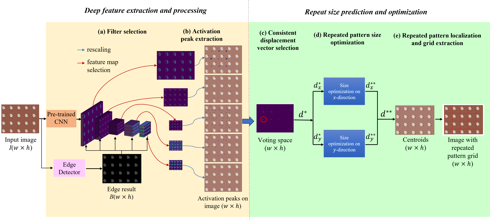

This repository contains code and materials for the paper _Efficient and Effective Detection of Repeated Pattern from Fronto-Parallel Images with Unknown Visual Contents,_ contributed by Hong Qu, Yanghong Zhou, P. Y. Mok*, Gerhard Flatz, and Li Li*. All rights reserved by authors.

-----
## Introduction

This study examines the efficient detection of repeated patterns from unknown fronto-parallel images. Repeated patterns are everywhere; a repeated pattern can be defined as the smallest unit that can tile the entire image, and it represents the primary information of the image in a compact form. Detection of such repeated patterns also supports numerous downstream applications, such as image retrieval and image synthesis. In this paper, a hybrid method is proposed to keep a good balance among content diversity, topology regularity and the trade-off between robustness and processing speed. In particular, this study first leverages activations from selected deep features of a pre-trained Convolutional Neural Network (CNN) to predict initial repeated pattern size options of the input images. Accurate repeated patterns are then obtained for the input images by a new optimization algorithm. Extensive experiments are conducted on a new dataset of fronto-parallel textile images as well as another set of real-world non-textile images to demonstrate the superiority of the proposed method. The accuracy of the proposed method is 0.673, which is 20% higher than the baseline method and the time cost is only 11% of the baseline. 

## Dataset

the proposed RPD dataset under link: https://pan.baidu.com/s/1Feul3m17limKiTTewMmWlQ?pwd=m9zn

## Related resources
related weights under link: https://pan.baidu.com/s/1fAMODQK3izoWLJRZM51xLg?pwd=lle8 

## Configuration file
Please see the _requirements.txt_
